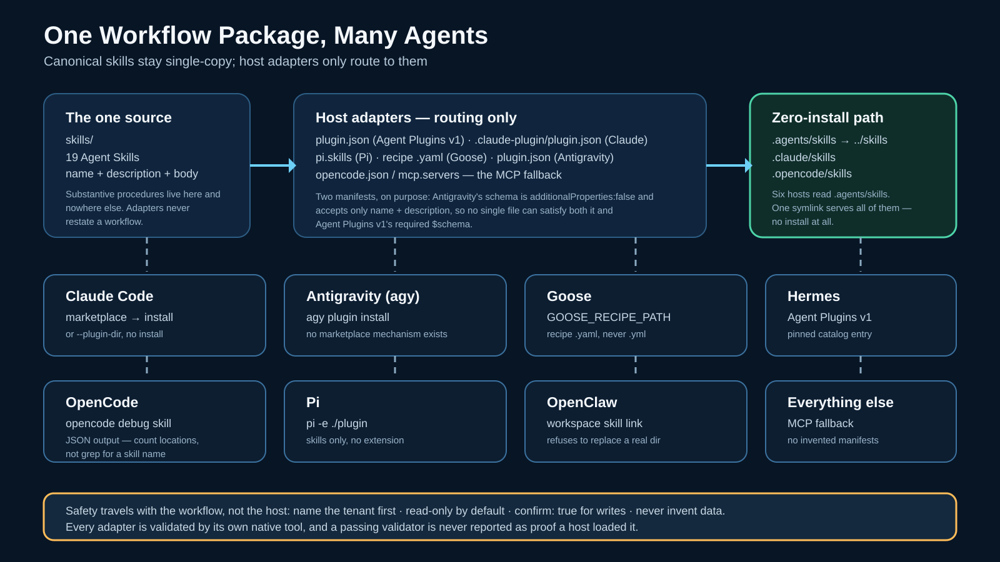

# Microsoft 365 Security — agent plugin

Portable security-investigation workflows packaged once for **Claude Code**,
**Antigravity (`agy`)**, **Goose**, **Pi**, **OpenCode**, **OpenClaw**, and any
MCP-compatible agent.

**To use the workflows — paste this into your agent, one line:**

> Install the microsoft-graph-security plugin, then route my request through `skills/m365-security-workflows/SKILL.md` to the canonical skill for it; this is a read-only-by-default Microsoft 365 MCP suite where writes need an explicit `confirm: true`, and every answer must open by naming the tenant from `gateway://session`.

## Layout

| Path | Host |
|---|---|
| `plugins/microsoft-graph-security/` | Claude Code, Pi, Hermes (Agent Plugins v1) |
| `antigravity/microsoft-graph-security/` | Antigravity `agy` |
| `goose/m365-security-workflows.yaml` | Goose |

## Install — one line, for the agent

> Identify which agent you are, then do exactly your own step and stop: **Claude Code** — `claude plugin marketplace add RohiRIK/microsoft-graph-security` then `claude plugin install microsoft-graph-security@rohirik-m365-security` (or, to try it with nothing installed, `claude --plugin-dir ./plugins/microsoft-graph-security`); **Antigravity / agy** — `agy plugin install ./antigravity/microsoft-graph-security`; **Goose** — `export GOOSE_RECIPE_PATH="$PWD/goose"` then `goose recipe list`; **Pi** — `pi -e ./plugins/microsoft-graph-security`; **Hermes** — `hermes plugins install microsoft-graph-security` once the catalog entry is merged; **OpenCode, OpenClaw, or anything reading `.agents/skills`** — install nothing, the skills are already discovered; **any other MCP client** — point it at the gateway from the main repository, this package carries the skills, not the server; then load the `m365-security-workflows` skill and route every request through it to the canonical skill for that request, never improvising a procedure.

## Safety

- **Read-only by default.** Write tools exist only when the backend runs with
  its write opt-in, and destructive/critical writes still need `confirm: true`.
- **Name the tenant first.** Every investigation opens by reading the gateway
  session resource and stating the tenant display name and GUID.
- **Never invent data.** No fabricated users, profiles, tenants, or results.
- **No secrets ship here.** No credentials, no tenant configuration, no
  personal data.

## Licence

MIT — see [LICENSE](LICENSE).
